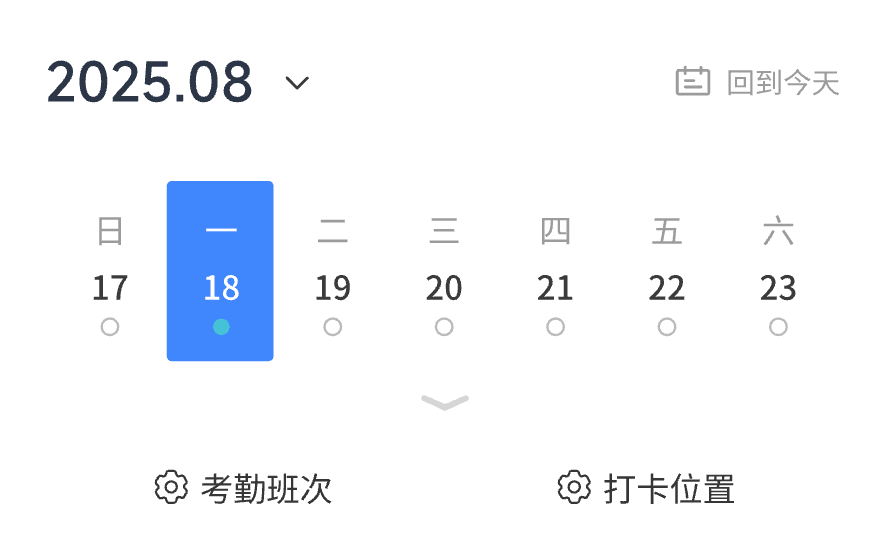
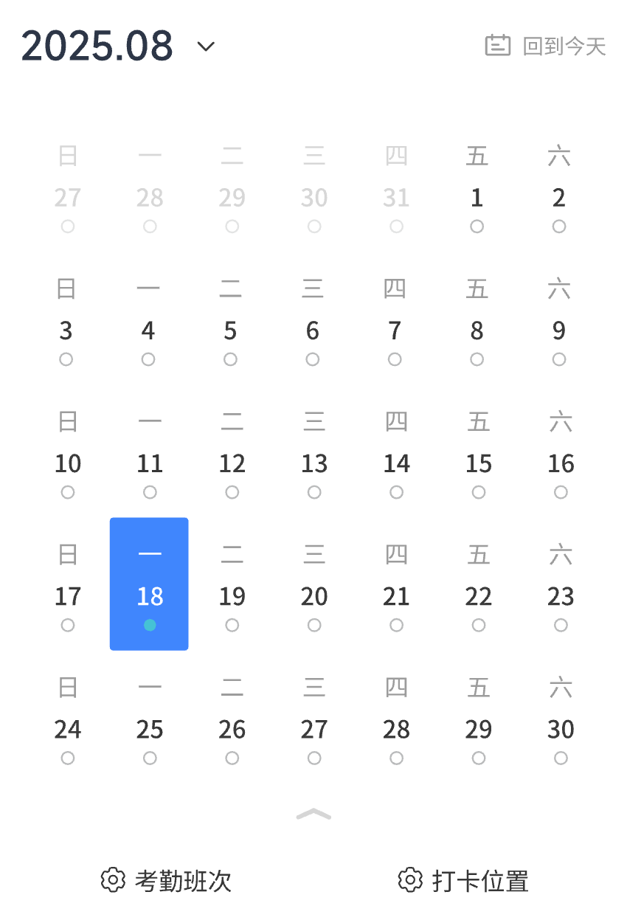

# 微信小程序周/月日历组件

一个原生微信小程序日历组件示例，默认显示当前周，可切换到当月视图并选择日期。仓库同时提供最小演示页面和界面截图。

## 已实现功能

- 当前周七天展示
- 当前月完整周网格展示
- 周视图与月视图切换
- 当天标记与日期选中样式
- 月视图中点击非本月日期时不改变选择

## 使用方式

将 `components/yr-calendar/` 复制到小程序项目，在页面 JSON 中注册：

```json
{
  "usingComponents": {
    "yr-calendar": "/components/yr-calendar/yr-calendar"
  }
}
```

然后在 WXML 中使用：

```xml
<yr-calendar></yr-calendar>
```

可以直接用微信开发者工具导入仓库根目录查看示例。没有当前 AppID 权限时，请改用自己的测试号或 AppID。

## 当前边界

- 组件按周日作为一周的第一天。
- 年月初始化为设备当前日期，尚不支持外部传入日期或切换月份。
- 选择日期只更新组件内部状态，尚未向父页面触发日期变更事件。
- 样式和图片路径与当前项目资源绑定，复制到其他项目时需要一并迁移 `assets/image/` 中的图标或替换图片路径。
- 周视图跨月选择与周/月视图间的选中状态同步仍需完善；“回到今天”当前只是文字，没有点击行为。
- 本次验证了 JavaScript 语法与本地图标路径；尚未在微信开发者工具和真机中复验交互。

## 效果预览

| 默认周视图 | 展开后的月视图 |
| --- | --- |
|  |  |

## 许可证

当前仓库未声明开源许可证。在补充许可证前，默认不授予复制、修改或再发布权限。
